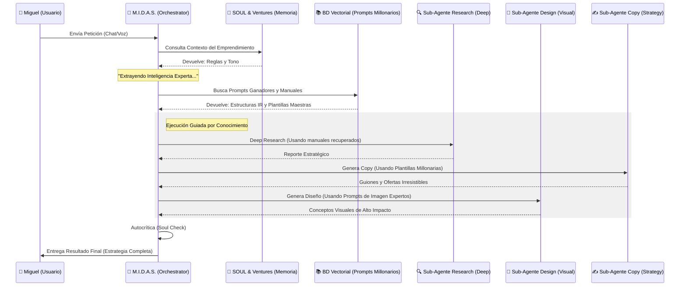

# 📊 Arquitectura de Flujo: M.I.D.A.S. Multi-Venture Orchestrator

Este diagrama detalla cómo interactúas con el sistema y cómo M.I.D.A.S. orquesta sus procesos internos de forma autónoma.



## 📂 Desglose de Procesos

1.  **Identificación de Venture:** M.I.D.A.S. detecta automáticamente si estás trabajando en el negocio de "Inversiones", "Inmobiliario" o "Marketing" para no mezclar estrategias.
2.  **Orquestación de Sub-Agentes:** El Cerebro Central no hace el trabajo pesado; delega en las **Skills** especializadas que tienen sus propios prompts maestros.
3.  **Persistencia del Soul:** Antes de entregarte la respuesta, M.I.D.A.S. verifica si el tono y la ética coinciden con lo definido en tu archivo `SOUL.md`.
4.  **Memoria Evolutiva:** El sistema anota qué te gustó y qué no en el archivo de memoria del emprendimiento para ser más certero en la próxima sesión.
```
